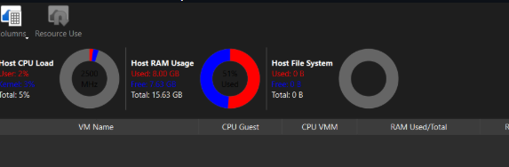

# **EXPERIMENT – 1**

## Virtual Machine and Container Setup

---

## **Part A: Virtual Machine using Vagrant (Windows)**

---

### **Step 1: Install VirtualBox**

Download and install VirtualBox from the official website:

🔗 [https://www.virtualbox.org/wiki/Downloads](https://www.virtualbox.org/wiki/Downloads)


---

### **Step 2: Install Vagrant**

Download and install Vagrant from:

🔗 [https://developer.hashicorp.com/vagrant/install](https://developer.hashicorp.com/vagrant/install)


---

### **Verify Vagrant Installation**

Check the installed version:

```bash
vagrant --version
```


---

### **Step 3: Initialize Vagrant with Ubuntu Box**

Initialize Vagrant using Ubuntu:

```bash
vagrant init hashicorp/bionic64
```


---

### **Start the Virtual Machine**

```bash
vagrant up
```


---

### **Access the Virtual Machine**

```bash
vagrant ssh
```


---

### **Step 4: Install Nginx inside the VM**

```bash
sudo apt update
sudo apt install -y nginx
sudo systemctl start nginx
```

---

### **Verify Nginx Installation**

```bash
curl localhost
```


---

### **Utilization Matrix (Running State)**


---

### **Stop the Virtual Machine**

```bash
vagrant halt
```



---

### **Remove the Virtual Machine**

```bash
vagrant destroy
```

---

## **Part B: Container using WSL**

---

### **Step 1: Install WSL 2**

```bash
wsl --install
```


---

### **Step 2: Install Ubuntu on WSL**

```bash
wsl --install -d Ubuntu
```


---

### **Step 3: Install Docker Engine inside WSL**

```bash
sudo apt update
sudo apt install -y docker.io
sudo systemctl start docker
sudo usermod -aG docker $USER
```


>  Logout and login again to apply group changes.

---

### **Step 4: Run Ubuntu Container with Nginx**

```bash
docker pull nginx
docker run -d -p 8080:80 --name nginx-container nginx
```


---

### **Step 5: Verify Nginx in Container**

```bash
curl localhost:8080
```


---

## **Result**

Virtual machines were successfully created using Vagrant and containers were deployed using Docker inside WSL. Nginx was installed and verified in both environments.

---