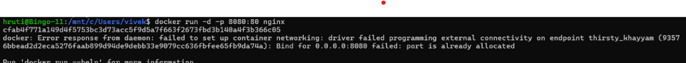

# EXPERIMENT – 2

## Docker Installation, Configuration and Running Images


## **Software Requirements**

* Operating System: Ubuntu / Linux
* Docker Engine

---

## **Step-1: Pull Docker Image**

Pull a Docker image from Docker Hub.

```bash
docker pull nginx
```

Verify the image:

```bash
docker images
```

**Screenshot:**


---

## **Step-2: Run Container with Port Mapping**

Run a container from the pulled image with port mapping.

```bash
docker run -d -p 8080:80 --name webserver nginx
```

**Screenshot:**


---

## **Step-3: Verify Running Containers**

Check running containers and verify application access.

```bash
docker ps
```

Access in browser:

```
http://localhost:8080
```

**Screenshot:**


---

## **Step-4: Stop Container**

Stop the running container.

```bash
docker stop webserver
```

**Screenshot:**


---

## **Step-5: Remove Container**

Remove the stopped container.

```bash
docker rm webserver
```

📸 **Screenshot:**


---

## **Step-6: Remove Docker Image**

Remove the Docker image from the system.

```bash
docker rmi nginx
```

📸 **Screenshot:**


---

## **Result**

Docker was successfully installed and configured.
Images were pulled, containers were run with port mapping, verified, stopped, removed, and Docker images were deleted successfully.

---

## **Conclusion**

This experiment demonstrates Docker image management, container lifecycle management, and port mapping using Docker commands.