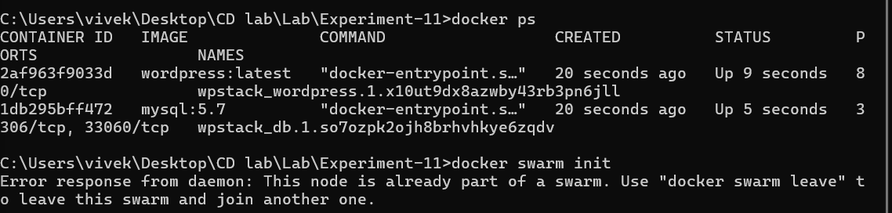
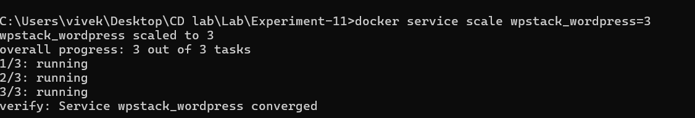
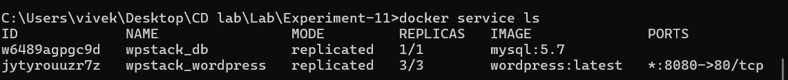
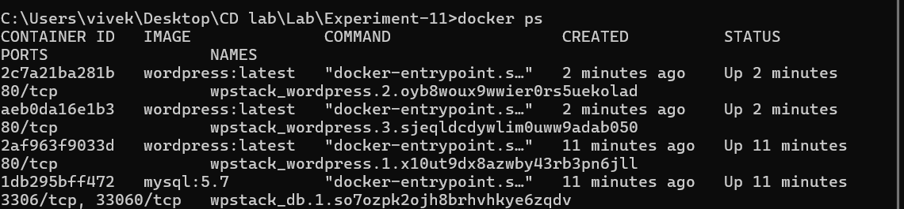

# Experiment 11

## Orchestration using Docker Compose & Docker Swarm

---

##  Objective

To understand container orchestration and implement scaling, load balancing, and self-healing using Docker Swarm by extending a Docker Compose application.

---

##  Theory

###  What is Orchestration?

Orchestration is the **automatic management of containers**, including:

* Scaling (increase/decrease containers)
* Self-healing (restart failed containers)
* Load balancing (distribute traffic)
* Multi-host deployment

---

###  Evolution Path

```
docker run → Docker Compose → Docker Swarm → Kubernetes
```

| Tool           | Description                   |
| -------------- | ----------------------------- |
| docker run     | Single container              |
| Docker Compose | Multi-container (single host) |
| Docker Swarm   | Orchestration (basic)         |
| Kubernetes     | Advanced orchestration        |

---

##  Prerequisites

* Docker installed
* Docker Swarm enabled
* `docker-compose.yml` file (WordPress + MySQL)

---

##  Docker Compose File

```yaml
version: '3.9'
services:
  db:
    image: mysql:5.7
    environment:
      MYSQL_ROOT_PASSWORD: rootpass
      MYSQL_DATABASE: wordpress
      MYSQL_USER: wpuser
      MYSQL_PASSWORD: wppass
    volumes:
      - db_data:/var/lib/mysql

  wordpress:
    image: wordpress:latest
    depends_on:
      - db
    ports:
      - "8080:80"
    environment:
      WORDPRESS_DB_HOST: db:3306
      WORDPRESS_DB_USER: wpuser
      WORDPRESS_DB_PASSWORD: wppass
      WORDPRESS_DB_NAME: wordpress
    volumes:
      - wp_data:/var/www/html

volumes:
  db_data:
  wp_data:
```

---

##  Procedure

###  Step 1: Clean Previous Setup

```bash
docker compose down -v
docker ps
```

---

###  Step 2: Initialize Swarm

```bash
docker swarm init
docker node ls
```

---

###  Step 3: Deploy Stack

```bash
docker stack deploy -c docker-compose.yml wpstack
```

---

###  Step 4: Verify Services

```bash
docker service ls
docker ps
```

---

###  Step 5: Access Application

Open browser:

```
http://localhost:8080
```

---

###  Step 6: Scale Application

```bash
docker service scale wpstack_wordpress=3
docker service ls
```


---

###  Step 7: Verify Scaling

```bash
docker ps
```

 Three WordPress containers should be running


---

###  Step 8: Test Self-Healing

```bash
docker kill <container-id>
docker service ps wpstack_wordpress
```

 Swarm automatically recreates container

---

###  Step 9: Remove Stack

```bash
docker stack rm wpstack
docker service ls
docker ps
```

---

##  Observations

* Multiple containers run simultaneously after scaling
* No port conflict occurs
* Load balancing is handled internally by Swarm
* Containers are automatically recreated if terminated

---

##  Analysis (Compose vs Swarm)

| Feature        | Docker Compose | Docker Swarm |
| -------------- | -------------- | ------------ |
| Scope          | Single host    | Multi-node   |
| Scaling        | Manual         | Automatic    |
| Load Balancing | No             | Yes          |
| Self-Healing   | No             | Yes          |
| Deployment     | Containers     | Services     |

---

##  Result

Docker Swarm successfully deployed a multi-container application, scaled it to multiple replicas, performed load balancing, and demonstrated self-healing by automatically replacing failed containers.

---

##  Conclusion

Docker Compose is useful for development, while Docker Swarm provides orchestration features required for production environments such as scaling, fault tolerance, and load balancing.

---