# Experiment 3: Docker – NGINX & Web Application Containerization

This repository contains **Experiment‑3**, demonstrating Docker fundamentals through NGINX deployment, custom image creation, image comparison, volume usage, and preparation of a sample Flask web application for containerization.

---

##  Objective

To understand and implement Docker containerization concepts by:

* Running official Docker images
* Building custom Docker images using different base OS images
* Comparing image sizes and layers
* Serving custom content using Docker volumes
* Preparing a simple web application for containerization

---

##  Experiment Structure

```
EXPERIMENT-3/
│
├── Part 1/                # Official NGINX image
├── Part 2/                # Custom NGINX (Ubuntu base)
├── Part 3/                # Custom NGINX (Alpine base)
├── Part 4/                # Image comparison
├── Part 5/                # Custom HTML using volumes
├── Experiment 3 Part 2/
│   └── flask-app/         # Sample Flask web application
│       ├── app.py
│       └── requirements.txt
└── README.md
```

---

##  Part 1: Running Official NGINX Image

### Pull Image

```bash
docker pull nginx:latest
```

### Run Container

```bash
docker run -d -p 8080:80 --name exp3-nginx nginx
```

### Verify

```bash
curl http://localhost:8080
```

✔ Default **NGINX welcome page** is displayed.

---

##  Part 2: Custom NGINX Using Ubuntu Base Image

### Dockerfile

```dockerfile
FROM ubuntu:22.04

RUN apt-get update && \
    apt-get install -y nginx && \
    apt-get clean && \
    rm -rf /var/lib/apt/lists/*

EXPOSE 80

CMD ["nginx", "-g", "daemon off;"]
```

### Build Image

```bash
docker build -t nginx-ubuntu .
```

### Run Container

```bash
docker run -d -p 8081:80 --name nginx-ubuntu nginx-ubuntu
```

### Observation

```bash
docker images nginx-ubuntu
```

 Custom Ubuntu-based NGINX image successfully created.

---

##  Part 3: Custom NGINX Using Alpine Base Image

### Dockerfile

```dockerfile
FROM alpine:latest

RUN apk add --no-cache nginx

EXPOSE 80

CMD ["nginx", "-g", "daemon off;"]
```

### Build Image

```bash
docker build -t nginx-alpine .
```

### Run Container

```bash
docker run -d -p 8082:80 --name nginx-alpine nginx-alpine
```

### Observation

```bash
docker images nginx-alpine
```

 Alpine-based image created (~16MB), demonstrating lightweight containers.

---

##  Part 4: Image Size & Layer Comparison

### Compare Images

```bash
docker images | findstr nginx
```

### Inspect Layers

```bash
docker history nginx
docker history nginx-ubuntu
docker history nginx-alpine
```

### Observations

* Ubuntu image has multiple filesystem layers
* Alpine image has minimal layers and smallest size
* Official NGINX image is optimized but larger than Alpine

---

##  Part 5: Serving Custom HTML Using Docker Volumes

### Create HTML File

```bash
mkdir html
echo "<h1>Hello from Docker NGINX</h1>" > html/index.html
```

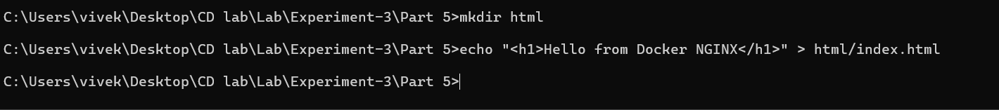

### Run Container with Volume Mapping (Windows CMD)

```bash
docker run -d -p 8083:80 -v "%cd%\html:/usr/share/nginx/html" nginx
```

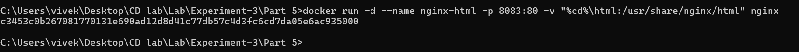

 Custom HTML page served successfully via NGINX.

---

## 🔹 Sample Web Application (Flask – Pre‑Containerization)

### app.py

```python
from flask import Flask
app = Flask(__name__)

@app.route('/')
def hello():
    return 'Hello, Docker!'

if __name__ == '__main__':
    app.run(host='0.0.0.0', port=5000)
```

### requirements.txt

```
flask
```

### Run Locally

```bash
python app.py
```

Access:

```
http://localhost:5000
```

 Application tested locally before containerization.

---


##  Tech Used

* Docker
* NGINX
* Ubuntu & Alpine Linux
* Python Flask

---

---

## Screenshots (Order of Execution)

> Paste screenshots in this exact order for clarity and evaluation. Use the filenames shown (or rename accordingly).

### Part 1: Official NGINX

1. **Pull Image** — `Image 0.png`

   ```md
   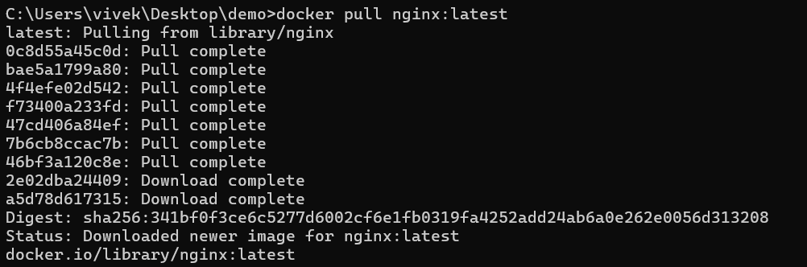
   ```
2. **Run & Verify in Browser** — `Image 4.png`, `Image 5.png`

   ```md
   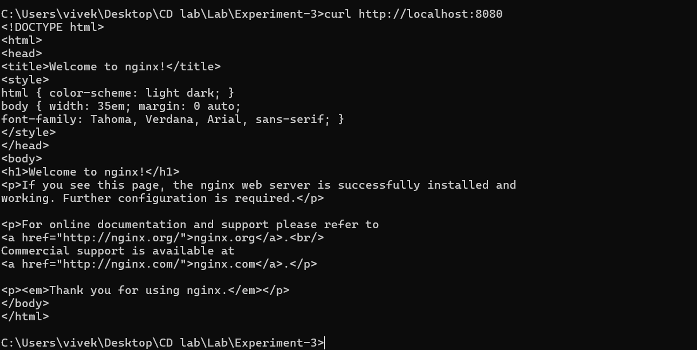
   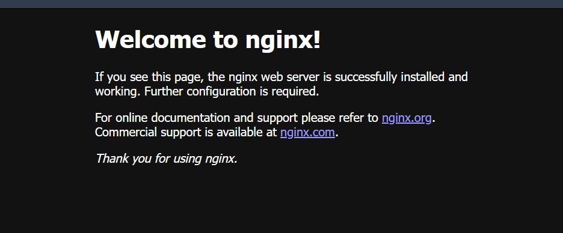
   ```

### Part 2: Custom NGINX (Ubuntu)

3. **Dockerfile (Ubuntu)** — `Part2_Image_1.png`

   ```md
   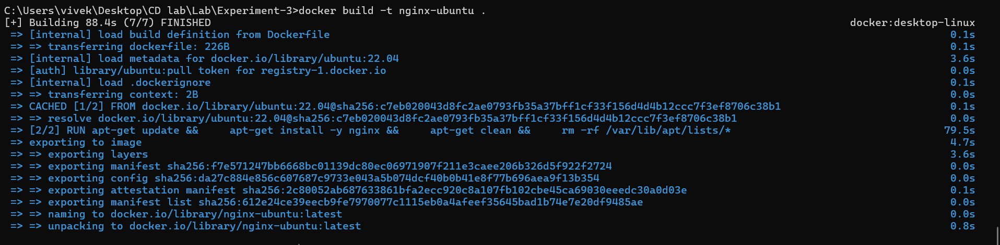
   ```
4. **Build Image Output** — `Part 2 Image 2.png`

   ```md
   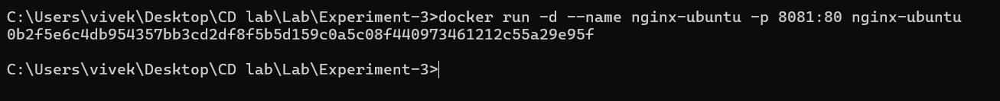
   ```
5. **Run Container & Browser Verify** — `Part 2 Image 3.png`

   ```md
   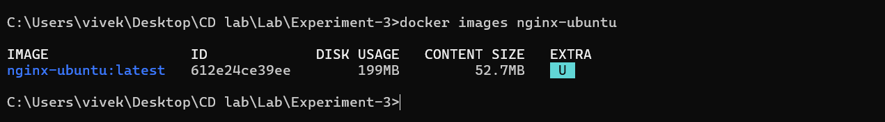
   ```

### Part 3: Custom NGINX (Alpine)

6. **Dockerfile (Alpine)** — `P3 Image1.png`

   ```md
   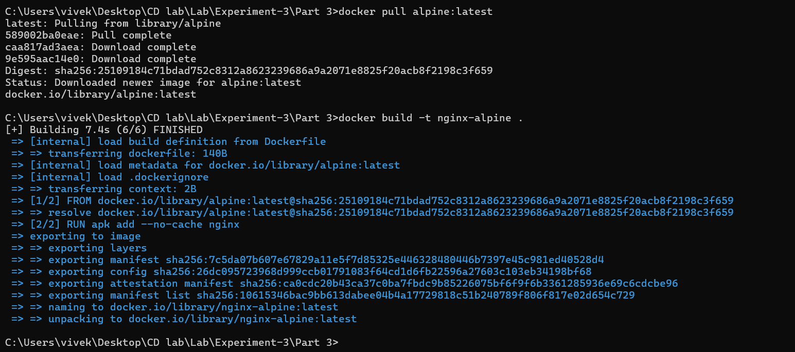
   ```
7. **Build Image Output** — `P3 Image 2.png`

   ```md
   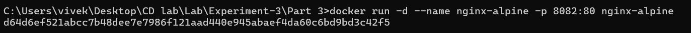
   ```
8. **Image Size Proof (~16MB)** — `P3 Image 3 ob.png`

   ```md
   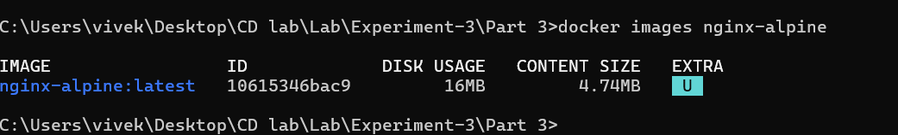
   ```

### Part 4: Image Comparison

9. **Compare Images** — `P4 Image 1.png`, `P4 Image 2.png`

   ```md
   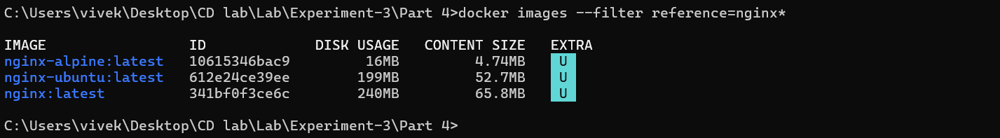
   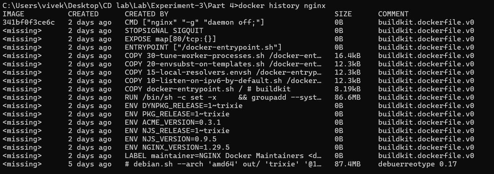
   ```
10. **Layer History** — `P4 Image 3.png`, `P4 Image 4.png`

    ```md
    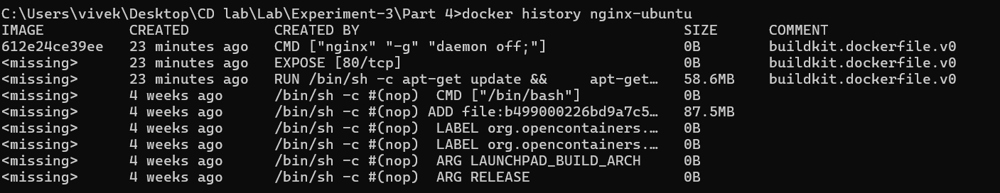
    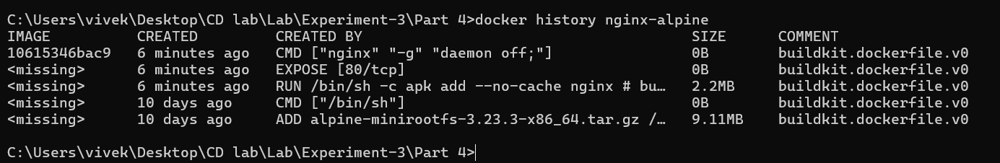
    ```

### Part 5: Volume Mount (Custom HTML)

11. **HTML File Created** — `P5 Image 1.png`

    ```md
    
    ```
12. **Run with Volume & Browser Output** — `P5 Image 2.png`

    ```md
    
    ```