#  Kubernetes Hands-on: Apache Web Server Deployment (httpd)

##  Objective

This project demonstrates how to deploy, manage, scale, and debug a simple Apache web server (`httpd`) using Kubernetes.

By completing this lab, you will learn:

* Run a Pod
* Convert Pod → Deployment
* Expose applications using Services
* Scale applications
* Debug issues
* Explore containers
* Understand self-healing

---

##  Prerequisites

* Kubernetes cluster (Minikube / Docker Desktop / Kind)
* `kubectl` installed
* Basic knowledge of containers

---

# 📂 Project Workflow

---

## 🔹 Step 1: Run a Pod

```bash
kubectl run apache-pod --image=httpd
kubectl get pods
```

 **Output Screenshot:**
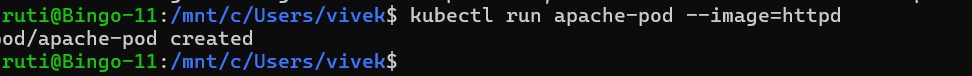
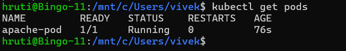

---

## 🔹 Step 2: Inspect the Pod

```bash
kubectl describe pod apache-pod
```

Check:

* Container image
* Port (80)
* Events

---

## 🔹 Step 3: Access the Application

```bash
kubectl port-forward pod/apache-pod 8081:80
```

Open:

```
http://localhost:8081
```

 Output: **Apache “It works!” page**

 **Output Screenshot:**
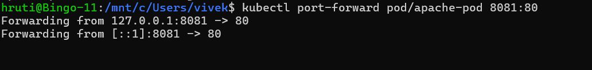
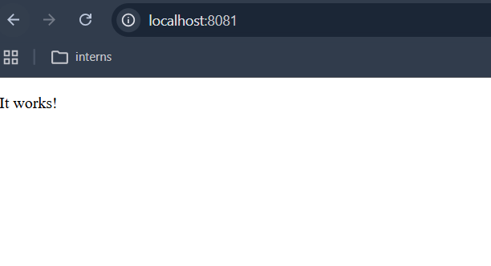
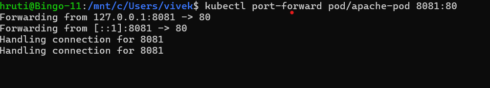


---

## 🔹 Step 4: Delete Pod

```bash
kubectl delete pod apache-pod
```

 **Output Screenshot:**
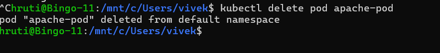

 Insight:

* Pod deleted permanently
* No self-healing

---

#  Convert to Deployment

---

## 🔹 Step 5: Create Deployment

```bash
kubectl create deployment apache --image=httpd
kubectl get deployments
kubectl get pods
```

 **Output Screenshot:**
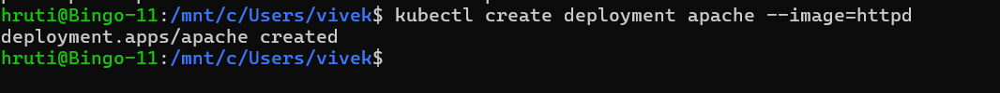
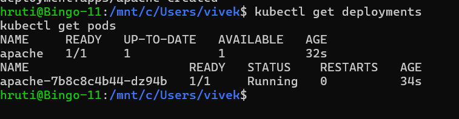
---

## 🔹 Step 6: Expose Deployment

```bash
kubectl expose deployment apache --port=80 --type=NodePort
kubectl port-forward service/apache 8082:80
```

Open:

```
http://localhost:8082
```

 **Output Screenshot:**
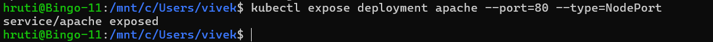
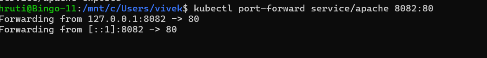
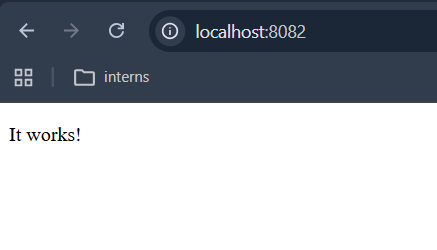


---

#  Modify Behavior

---

## 🔹 Step 7: Scale Deployment

```bash
kubectl scale deployment apache --replicas=2
kubectl get pods
```

 **Output Screenshot:**
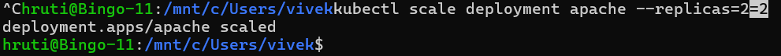
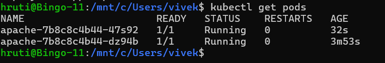

 Observation:

* Multiple pods running same application

---

## 🔹 Step 8: Load Distribution

* Refresh browser multiple times

 Traffic distributed across pods

---

#  Debugging Scenario

---

## 🔹 Step 9: Break the Application

```bash
kubectl set image deployment/apache httpd=wrongimage
kubectl get pods
```

 **Output Screenshot:**
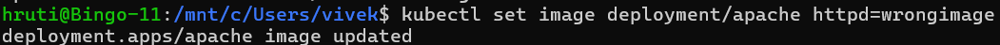
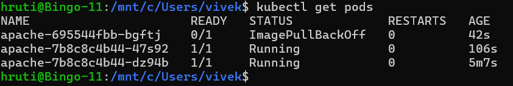

---

## 🔹 Step 10: Diagnose Issue

```bash
kubectl describe pod <pod-name>
```

 **Output Screenshot:**
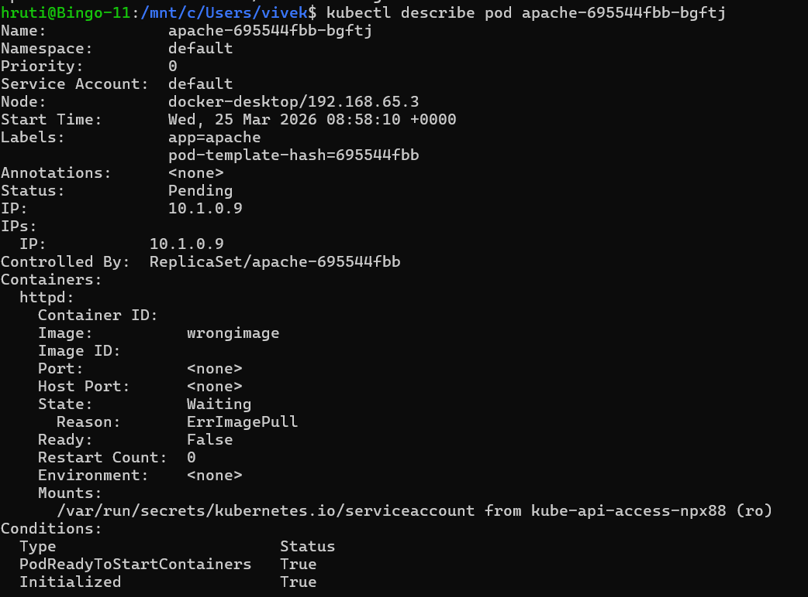

Check:

* `ImagePullBackOff`
* Error logs

 **Output Screenshot:**
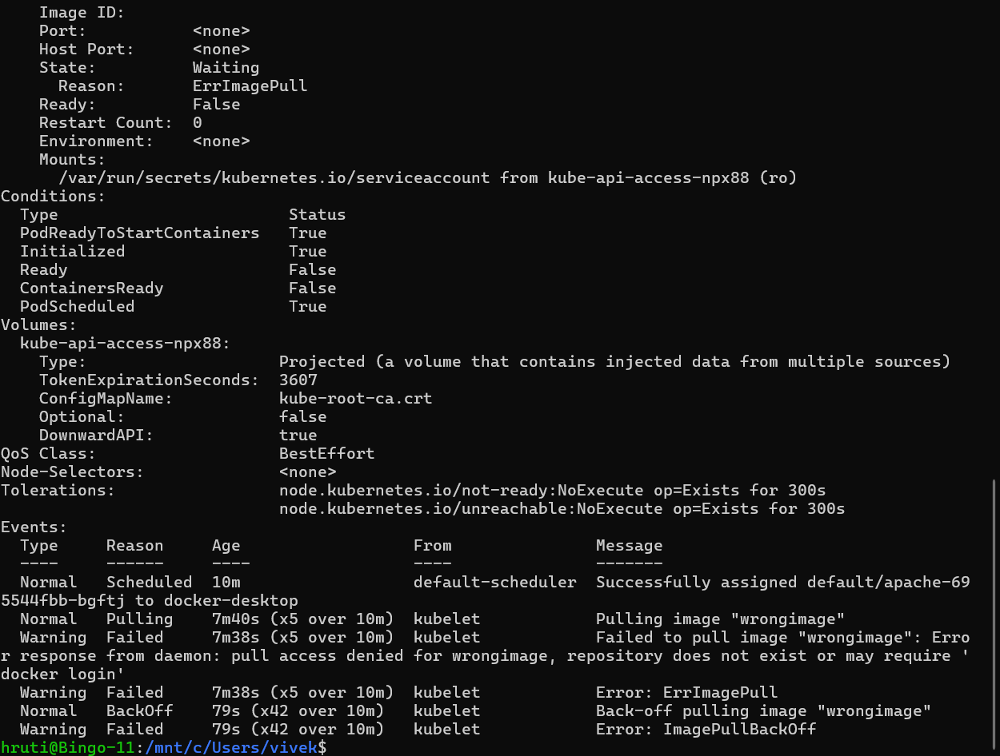

---

## 🔹 Step 11: Fix the Issue

```bash
kubectl set image deployment/apache httpd=httpd
```

 **Output Screenshot:**
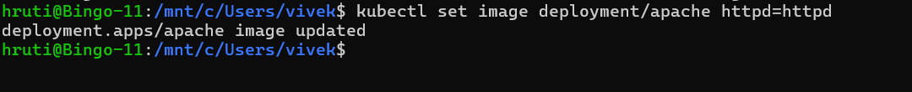

---

#  Explore Inside Container

---

## 🔹 Step 12: Exec into Pod

```bash
kubectl exec -it <pod-name> -- /bin/bash
```

Inside:

```bash
ls /usr/local/apache2/htdocs
```

 **Output Screenshot:**
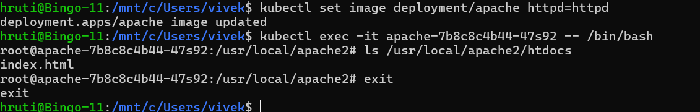


---

#  Self-Healing Feature

---

## 🔹 Step 13: Delete One Pod

```bash
kubectl delete pod <pod-name>
kubectl get pods -w
```

 **Output Screenshot:**
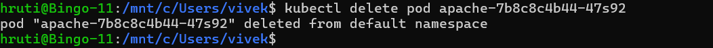
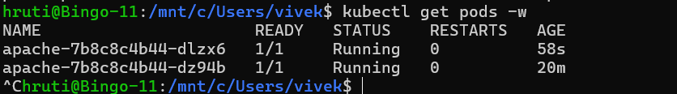
 Insight:

* Kubernetes recreates pod automatically

---

#  Cleanup

```bash
kubectl delete deployment apache
kubectl delete service apache
```

 **Output Screenshot:**
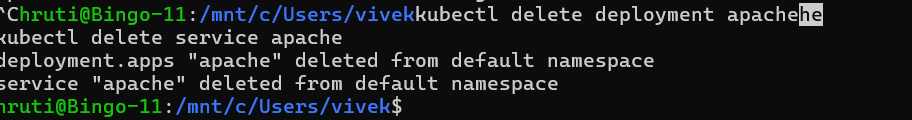

---

#  Key Learnings

* Difference between Pod and Deployment
* High availability in Kubernetes
* Scaling applications
* Debugging container issues
* Accessing container filesystem
* Self-healing mechanism

---

#  Optional Challenge

Modify web page dynamically:

```bash
kubectl exec -it <pod-name> -- /bin/bash
```

```bash
echo "Hello from Kubernetes" > /usr/local/apache2/htdocs/index.html
```

---

#  Conclusion

This project provides a complete hands-on understanding of running web applications in Kubernetes using Apache.

It covers:

* Deployment
* Scaling
* Debugging
* Container access
* Self-healing